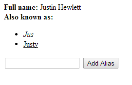

data-bind.lite
==============

Tiny 2-way data-binding library written in javascript.

Declarative syntax:
-------------------

Declaring a scope:
```html
<div data-scope="scope">
  ...
<div>
```
Any expressions within that element have the context of the "scope" model.

Binding to values:
```html
<p data-bind="fullName"></p>
```
```html
<input type="checkbox" data-bind="checked">
```

Binding to classes:
```html
<p data-class="myStyle"></p>
```

Binding to click events:
```html
<button data-click="addAlias(alias)">Add alias</button>
```

Binding to enter key press:
```html
<input data-enter="addAlias(alias)" type="text" data-bind="alias">
```

Repeating elements:
```html
<ul id="aliases" data-foreach="alias in aliases">
  <li data-bind="alias.title"></li>
</ul>
```

Model definition
-----------------

Declaring a scope:
```javascript
var model = new DataBind.Model('scope');
```

Defining an attribute:
```javascript
model.attr('firstName', 'Justin');
model.attr('items', {title: 'items', arr: [1, 2]});
```

Defining a computed property:
```javascript
model.computed('fullName' function() {
  return this.get('firstName') + ' ' + this.get('lastName'); 
});
```
Computed properties are automatically updated when any of their underlying properties change.

Defining an action:
```javascript
model.action('addItem', function(item) {
    this.get('items').push(item);
});
```

The return value of actions will be ignored.

Binding the model:
```javascript
var binder = new DataBind.Binder(model);
binder.bind();
```

Full example
--------------
Html:
```html
<div data-scope="aboutMe">
  <strong>Full name:</strong> <span data-bind="fullName"></span>
  <br>
  <strong>Also known as:</strong>
  <ul id="aliases" data-foreach="alias in aliases">
    <li data-bind="alias.title" data-class="alias.style"></li>
  </ul>

  <input data-enter="addAlias()" type="text" data-bind="newAlias">

  <button data-click="addAlias()">Add Alias</button>
</div>
```

Javascript:
```javascript
var model = new DataBind.Model('aboutMe');

model.attr('firstName', 'Justin');
model.attr('lastName', 'Hewlett');
model.attr('aliases', [{title: 'Jus', style: 'italic'}, {title: 'Justy', style: 'underline'}]);
model.attr('newAlias', '');

model.computed('fullName', function() {
  return this.get('firstName') + ' ' + this.get('lastName');
});

model.action('addAlias', function() {
  this.get('aliases').push({title: this.get('newAlias'), style: 'underline'});
  this.attr('newAlias', '');
});

var binder = new DataBind.Binder(model);
binder.bind();
```

Css:
```css
.underline {
  text-decoration: underline;
}

.italic {
  font-style: italic;
}
```

Results:


